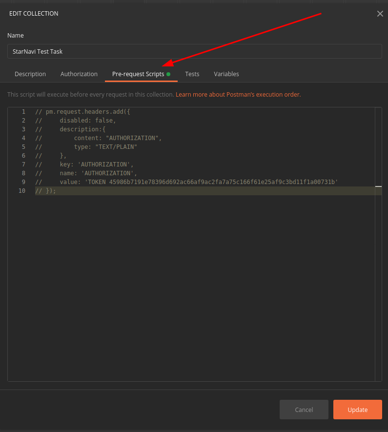
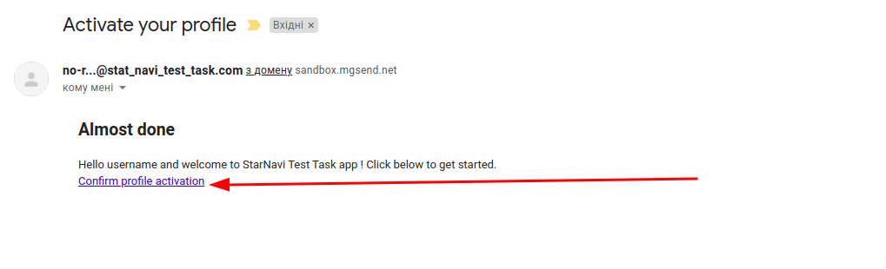
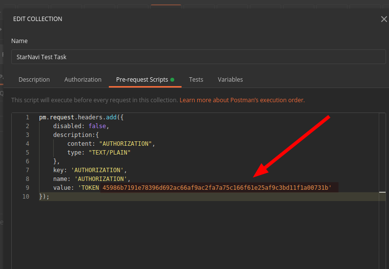
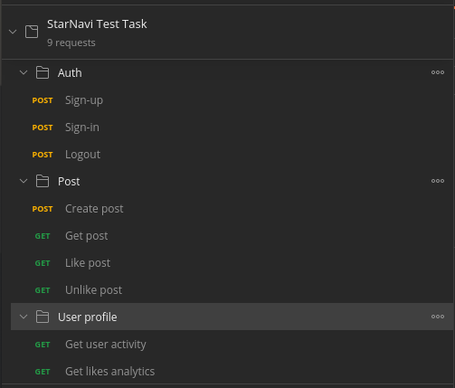

# StarNaviTestTask
Hello StarNavi team!

##Project set-up
- Download env file via link: https://drive.google.com/file/d/1YoOhk-24C_4HMwmra4xUQDD5NUk0tk-I/view?usp=sharing
- Create .env file in project directory and copy content of downloaded env file to it.
- Run command form project directory: docker-compose up --build.

##Make requests:
- Download Postman collection via the link: https://drive.google.com/file/d/1tmUilsQqvupYvHF10zsTleJnUTczIuvE/view?usp=sharing
- Import collection to your Postman app.
- Before do any request you need to comment-out a pre-request script. 

- After the sign-up request, you need to activate your profile via an email link:

- On sign-in request, you will be granted an access token that you need to copy to the pre-request script

- Now you can make any requests!
